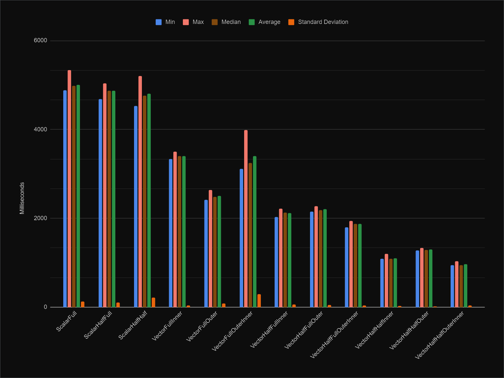

# FIRConvolution

## Description

A collection of 12 algorithms for FIR filter convolution, with a focus on half-band filtering.

Most of the algorithms are vectorized, leveraging SIMD extensions through Unity Burst.

The algorithms can also be used outside Unity and they will still be SIMD-accelerated.

Check the sample scene to see them in action and their performance using the profiler.

## Installation

Add the package to your Unity project using the following Git URL: 

`https://github.com/aybe/FIRConvolution.git?path=Assets/FIRConvolution`

## Performance

Half-band filter, 44100 Hz, 461 taps, 10 measurements, 1000 iterations, 1024 samples:

This would be the average performance when called from within `OnAudioFilterRead`.

The naming scheme for the different algorithms:

- `[Scalar|Vector]`
  - `Scalar` : 1 sample at a time
  - `Vector` : 4 samples at a time
- `[Full|Half]`
  - `Full` : full-band filter
  - `Half` : half-band filter
- `[Full|Half]` (only for half-band filter)
  - `Full` : iterating the taps loop fully, i.e. using 50% of the taps
    - in a half-band filter, half of the taps are zeros and thus can be ignored
  - `Half` : iterating the taps loop first half, i.e. using 25% of the taps
    - in addition to above, leveraging taps symmetry to halve the iterations
- `[Inner|Outer|OuterInner]`
  - `Inner` : taps loop vectorized
  - `Outer` : samples loop vectorized
  - `OuterInner` : both loops vectorized

