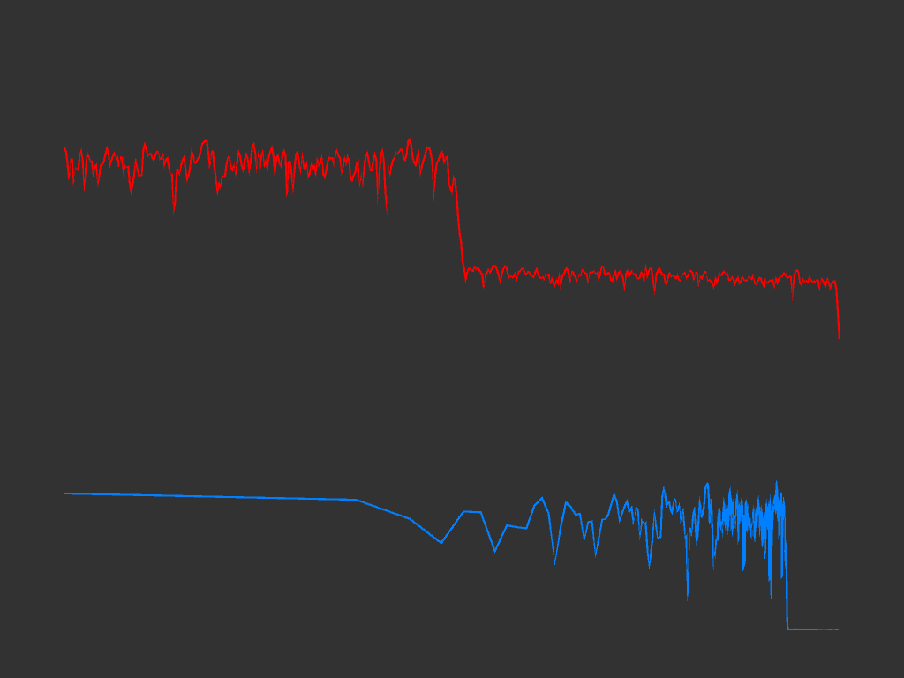

# FIRConvolution

## Description

A collection of 12 algorithms for FIR filter convolution, with a focus on half-band filtering.

Most of the algorithms are vectorized, leveraging SIMD extensions through Unity Burst.

The algorithms can also be used outside Unity and they will still be SIMD-accelerated.

Check the sample scene to see them in action and their performance using the profiler.

## Installation

Add the package to your Unity project using the following Git URL: 

`https://github.com/aybe/FIRConvolution.git?path=Assets/FIRConvolution`
